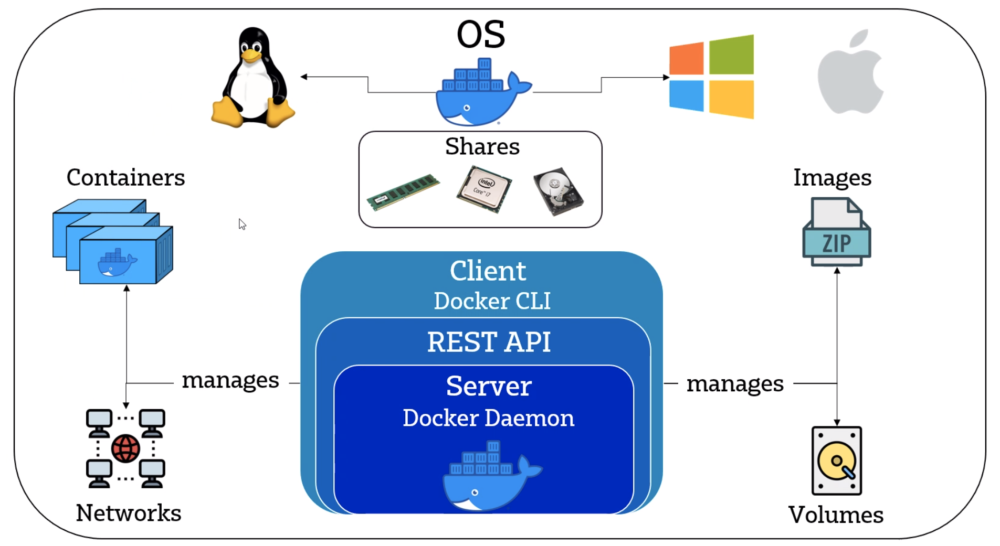
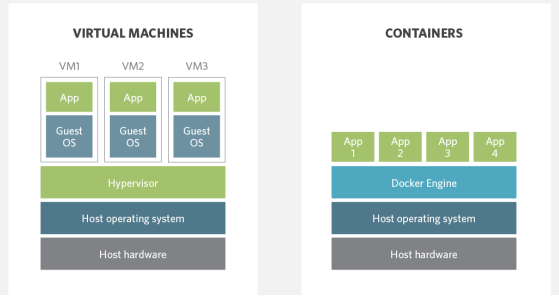
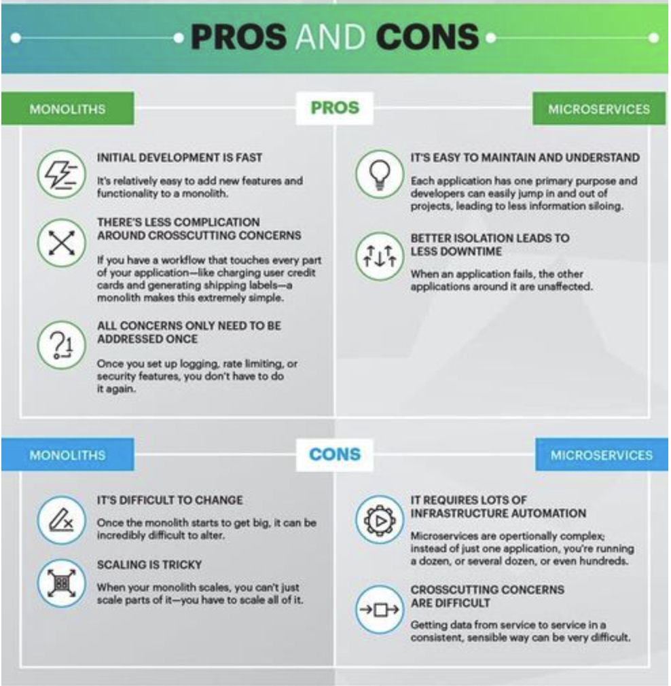

# Containerisation with Docker
_logo.svg.png)

## What is Containerisation 

Containerisation is defined as a form of operating system virtualization, through which applications are run in isolated user spaces called containers, all using the same shared operating system (OS).

Benefits:

- **Portability**: A container creates an executable package of software that is abstracted away from (not tied to or dependent upon) the host operating system, and hence, is portable and able to run uniformly and consistently across any platform or cloud. 
- **Speed**:  Containers are often referred to as “lightweight,” meaning they share the machine’s operating system (OS) kernel and are not bogged down with this extra overhead. 
- **Fault Isolation**: Each containerized application is isolated and operates independently of others. The failure of one container does not affect the continued operation of any other containers.
- **Ease of management**: Container orchestration platforms can ease management tasks such as scaling containerized apps, rolling out new versions of apps, and providing monitoring, logging and debugging, among other functions. e.g Kubernetes


## What is Docker



- Docker is an open-source platform for developing, shipping, and running applications
- It enables us to separate applications from the infrastructure
- It delivers software faster
- Docker is written in GO language

## Docker vs VM 
- Docker is lightweight and user-friendly
- Docker shares the resources of OS as opposed to using the OS completely
- Docker engine connects the container with the OS and only uses the resources required
- VM works with Hypervisor to connect guest OS/VM with Host OS


## Docker Architecture 


## Docker commands
- `Docker images`: Will present the images available
- `Docker ps`: To check the containers running
- `Docker ps -a`: To check every container running including hidden files
- `Docker pull`: to pull the image from docker hub
- `Docker run` : to run the image live directly from dockerhub
- `docker exec` -it [container id] bash: to access the running container
- `docker stop`: stops a running container
- `docker kill`: kills container by stopping execution. stop gives time to shut down gracefully
- `docker commit` [container id][username/imagename]: creates new image of an edited container on local system
- `docker rm [container id]`:removes container 
- `docker history [image name]`: to view history 
- `docker image rm [image name]`: deletes image 

#### Making docker docs available on our localhost 

```
docker run -d -p 4000:4000 docs/docker.github.io 
```

#### Logging into a running container 

```
docker exec -it <container-id/name> sh

```
#### Port mapping in our containers with localhost 
```
docker run -d -p localhost-port:container-port

```
#### Copying files to container 
```
docker cp <file to copy> <container_id>:path/to/file

```
#### Running a container with ghost
```
docker run -d -p 2368:2368 ghost 
```

#### Running nginx on port 80 
```
docker run -d -p 80:80 nginx 
```
#### Replacing nginx default page 

```
docker cp index.html a4700feaa1c0:/usr/share/nginx/html
```
About me page on localhost:


## DockerHub 


#### Commit to save changes to image, then push to dockerhub 
```
# docker commit <container_id> brittanyharrison/repo_name
docker push brittanyharrison/repo_name

```
**Note**:Repository name and local folder name must match 

## Building a Docker Image

- To build a docker image we need to create a Dockerfile

```dockerfile
# build image from official image of nginx
FROM nginx

# Label used as reference, maintainer to add info for who built image - optional
LABEL MAINTAINER=bkharrison94@gmail.com

# copy customised index.html file
COPY index.html /usr/share/nginx/html

# expose port 80 to launch in browser
EXPOSE 80

# CMD will run this command once all other instructions have been successfully completed
CMD ["nginx", "-g", "daemon off;"]
```
- To build the image run the commad:

```bash
# The . is the current location 
docker build -t brittanhyharrison/eng89_docker .
```
- To check the image is created: `docker images`

- To run the image on a port 

```bash
# maps to port 50 on localhost 
docker run -d -p 50:80 brittanhyharrison/eng89_docker
```

## Docker Volumes 
- To sync 
```shell
docker run -d -v index.html:/usr/share/nginx/html/ -p 5000:80 brittanyharrison/eng89_docker
```

- `docker volume ls`
- `docker volume inspect <volume-name>`
- `docker volume create --name nginx-volume`


# Micorseverces Architecture vs Monolithlic Architecture

- A **monolithic application** is built as a single and indivisible unit. Usually, such a solution comprises a client-side user interface, a server side-application, and a database.

- A **Microservices architecture** breaks it down into a collection of smaller independent units. These units carry out every application process as a separate service. So all the services have their own logic and the database as well as perform the specific functions.



## Choosing a monolithic architecture
- **Small team**: If you are a startup and your team is small, you may not need to deal with the complexity of the microservices architecture. A monolith can meet all your business needs so there is no emergency to follow the hype and start with microservices.
- **A simple application**: Small applications which do not demand much business logic, superior scalability, and flexibility work better with monolithic architectures.
- **No microservices expertise**: Microservices require profound expertise to work well and bring business value. If you want to start a microservices application from scratch with no technical expertise in it, most probably, it will not pay off.
- **Quick launch**: If you want to develop your application and launch it as soon as possible, a monolithic model is the best choice. It works well when you aim to spend less initially and validate your business idea.

## Choosing a microservices architecture
- **Microservices expertise** Without proper skills and knowledge, building a microservice application is extremely risky. Still, just having the architecture knowledge is not enough. You need to have DevOps and Containers experts since the concepts are tightly coupled with microservices. Also, domain modelling expertise is a must. Dealing with microservices means splitting the system into separate functionalities and dividing responsibilities.
- **A complex and scalable application**:  The microservices architecture will make scaling and adding new capabilities to your application much easier. So if you plan to develop a large application with multiple modules and user journeys, a microservice pattern would be the best way to handle it.
- **Enough engineering skills**: Since a microservice project comprises multiple teams responsible for multiple services, you need to have enough resources to handle all the processes.
