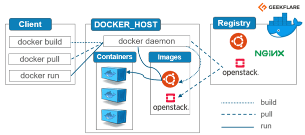

# Containerisation with Docker
_logo.svg.png)

## What is Containerisation 

Containerisation is defined as a form of operating system virtualization, through which applications are run in isolated user spaces called containers, all using the same shared operating system (OS).

Benefits:

- **Portability**: A container creates an executable package of software that is abstracted away from (not tied to or dependent upon) the host operating system, and hence, is portable and able to run uniformly and consistently across any platform or cloud. 
- **Speed**:  Containers are often referred to as “lightweight,” meaning they share the machine’s operating system (OS) kernel and are not bogged down with this extra overhead. 
- **Fault Isolation**: Each containerized application is isolated and operates independently of others. The failure of one container does not affect the continued operation of any other containers.
- **Ease of management**: Container orchestration platforms can ease management tasks such as scaling containerized apps, rolling out new versions of apps, and providing monitoring, logging and debugging, among other functions. e.g Kubernetes

## What is Docker

- Docker is an open-source platform for developing, shipping, and running applications
- It enables us to separate applications from the infrastructure
- It delivers software faster
- Docker is written in GO language

## Docker vs VM 
- Docker is lightweight and user-friendly
- Docker shares the resources of OS as opposed to using the OS completely
- Docker engine connects the container with the OS and only uses the resources required
- VM works with Hypervisor to connect guest OS/VM with Host OS

## Docker Architecture 

## Docker commands
- `Docker images`: Will present the images available
- `Docker ps`: To check the containers running
- `Docker ps -a`: To check every container running including hidden files
- `Docker pull`: to pull the image from docker hub
- `Docker run` : to run the image live directly from dockerhub
- `docker exec` -it [container id] bash: to access the running container
- `docker stop`: stops a running container
- `docker kill`: kills container by stopping execution. stop gives time to shut down gracefully
- `docker commit` [container id][username/imagename]: creates new image of an edited container on local system

## Micro-services Architechture 
